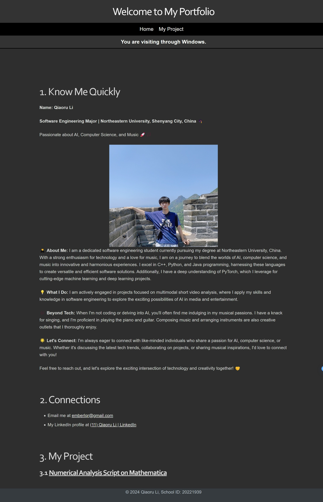
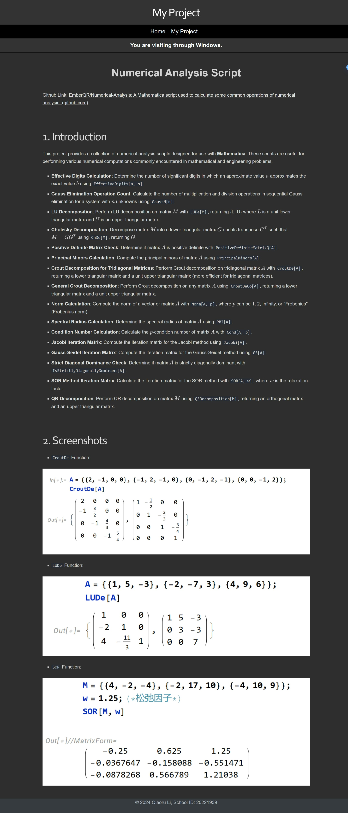

Explanations of Web Tutorial 1

# My Information

- Name: Qiaoru Li
- School ID: 20221939
- Class: International Class of Software Engineering

# Files and Explanations

**Note: Because of the javascript-related functionality used in the project, it is not feasible to run individual HTML documents separately. Please compile them through a local server!**

The project has 2 pages in total, which are Main Page and Project Page. The explanations of key files or folders are the following:

- `index.html` is the main page.
- `MainpageContent.html` is the main body of `index.html`.
- `nav.html` is the navigation which can be reused in all pages.
- `project.html` is the my-project introduction page.

- `ProjectContent.html` is the main body of `project.html`.
- `styles.css` defines the styles of `nav.html`.
- `/images` directory stores necessary image files used in the HTML files.
- `Main Page.jpg` is the screenshot of the main page.
- `Project Page.jpg` is the screenshot of the project page.

In the main body (`MainpageContent.html` and `ProjectContent.html`, I used markdown style, which is based on Typora's markdown framework.

Specially, I added a module that detects the user's system and shows what system the user is using to access the page. (shown in the screenshots)

# Project screenshots

- >  Main Page.jpg

  

- > Project Page.jpg

  